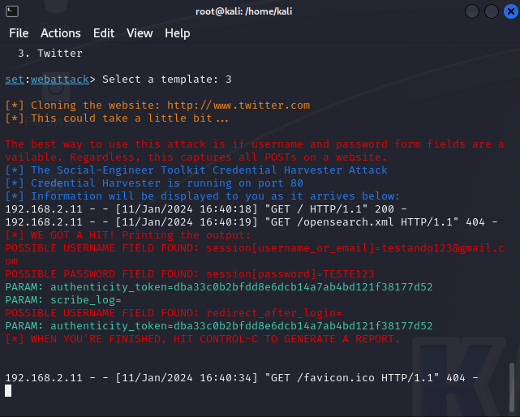

# Phishing para captura de senhas do Twitter

### Ferramentas

- Kali Linux
- Setoolkit

### Configurando o Phishing no Kali Linux

- Acesso root: ``` sudo su ```
- Iniciando o setoolkit: ``` sudo setoolkit ```
- Tipo de ataque: ``` 1 Social-Engineering Attacks ```
- Vetor de ataque: ``` 2 Web Site Attack Vectors ```
- Método de ataque: ``` 3 Credential Harvester Attack Method ```
- Método de ataque: ``` 1 Web Templates ```
- Selecionando um template: ``` 3 Twitter ```
- URL para clone: http://www.twitter.com

### Resutados


